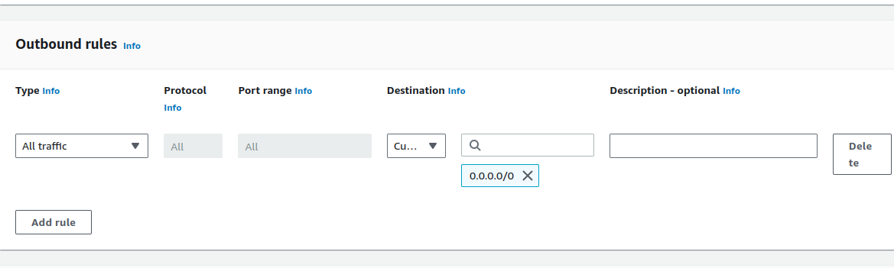

# Proyecto 1 - Grupo 12

## INTEGRANTES

|   Carne   |        Nombre Completo        |
| :-------: | :---------------------------: |
| 202010055 |      Derek Esquivel Díaz      |
| 202004804 | José Andrés Montenegro Santos |
| 202004724 |  Carlos Daniel Acabal Pérez   |
| 201403793 | Kevin Nicolas Garcia Martinez |

## Objetivos del Manual

## Arquitectura del proyecto.

## Diagrama Entidad Relación

## Usuarios IAM

Proceso para crear usuarios IAM

Creando un usuario IAM de ejemplo con el nombre "nuevo". 

Configurando el tipo de contraseña de usuario. 

Selección de permisos/políticas directamente. 

### Administrador

En el caso del usuario Administrador tendrá el permiso "AdministratorAccess"

### Acceso Completo S3

Para el manejo de Buckets se crea un usuario con permisos "AmazonS3FullAccess"

## Servicios utilizados

### S3

Se configuró el nombre del Bucket, la región dónde reside y los dueños de los
objetos. 

Se permitió el acceso público al Bucket y se confirmó la decisión.

Deshabilitamos el manejo de versiones de objetos del Bucket para no tener
variantes. 

El cifrado del Bucket se queda por defecto. 

Una vez creado el Bucket, se configura la política para el acceso a objetos del
Bucket. 

Carpetas donde se almacenará la multimedia de SoundStream

### EC2

Se configuró el nombre de la instancia EC2 como "python-server"

Se selección de SO Ubuntu 22.04 LTS 

Selección del tipo de instancia para la capa gratuita. Se reutilizaron un par de
llaves para conectarse a la instancia. 

Se seleccionó un grupo de segorudad existente [Ver aquí.](#grupos-de-seguridad)

Se configuró el almacenamiento con 8GB de tipo EBS 

#### Grupos de seguridad

Se configuró el nombre del grupo de seguridad, la descripción es opcional

Se configuran las reglas de entrada. Específicamente HTTP, HTTPS, SSH y Custom
TCP en 3000 donde estará escuchando el servidor

Se configura las reglas de salida a todos lados.  Grupo de
seguridad creado. 

### Load Balancer

Se configuró el nombre del balanceador, el tipo de esquema es Internet-facing
para que esté expuesto al internet y se seleccionó el tipo de subred que usará.
 En el mapeo de red se seleccionó una VPC por defecto para
balanceadores de carga y tendrá acceso a 2 AZ cada una con su subred.

Se seleccionó un grupo de segorudad existente [Ver aquí.](#grupos-de-seguridad)

Se seleccionó un grupo objetivo existente [Ver aquí.](#grupos-de-seguridad)

#### Grupo Objetivo

Se seleccionó el tipo de objetivo como ip para agregar IPs de las instancias EC2

Configuramos el nombre, el tipo de IP y protocolo HTTP. También una VPC por
defecto. HTTP1 para enviar las solicitudes a los objetivos HTTP.

Para que el balanceador verifique el estado del grupo deberá hacer una petición
HTTP a "/". 

Agregamos un objetivo ingresando su dirección IP y puerto.

Monitoreo de objetivos configurados. 

### RDS

## Conclusiones

- Se determinó que crear un usuario con permisos exclusivamente par aun servicio
  permite que varios integrantes puedan controlar ese servicio sin poner en
  riesgo otros servicios o al usuario Root.
- Se determinó que existen servicios que requieren estar en una misma Región,
  AZ, o VPC para comunicarse.
