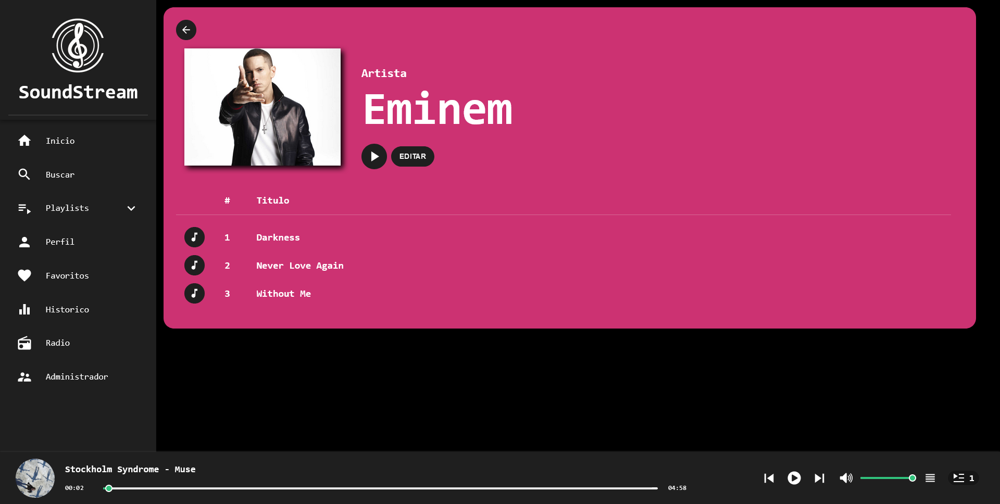
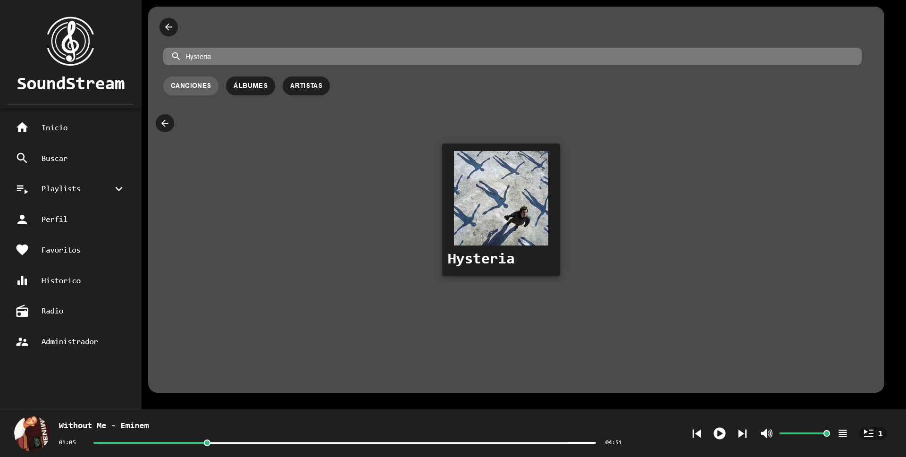
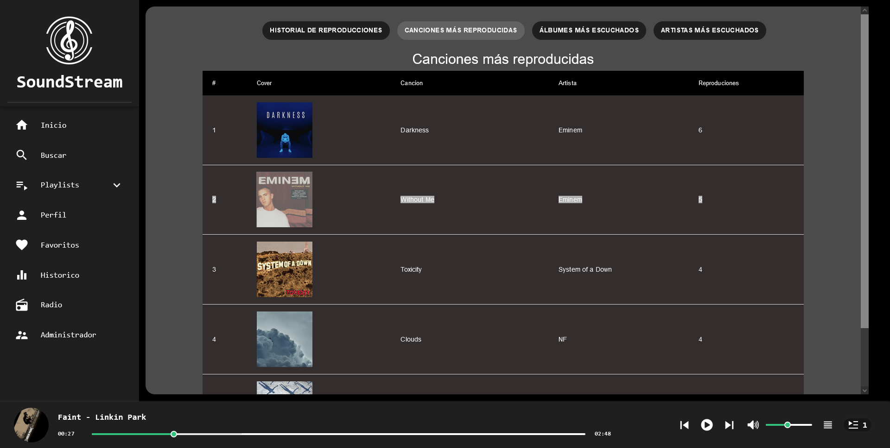

# Proyecto 1 - Grupo 12

## INTEGRANTES

|   Carne   |        Nombre Completo        |
| :-------: | :---------------------------: |
| 202010055 |      Derek Esquivel Díaz      |
| 202004804 | José Andrés Montenegro Santos |
| 202004724 |  Carlos Daniel Acabal Pérez   |
| 201403793 | Kevin Nicolas Garcia Martinez |

## Objetivos del Manual

## Descripcion de la aplicación

SoundStream es una plataforma de transmisión de música basada en la nube. Diseñado para ser accedido a través de cualquier navegador web, SoundStream permite a los usuarios disfrutar de sus canciones, albumes o artistas favoritos, asi como crear sus propias playlist para escuchar su musica favorita.

El módulo de administrador de SoundStream es un conjunto de herramientas para curadores y administradores de contenido, que les permite administrar los recursos, como agregar, editar o eliminar canciones, artistas y álbumes de la plataforma sin esfuerzo, asi como generar un análisis para obtener información las canciones, albumes o artistas populares populares.

## Utilización

### Registro

Al acceder a la aplicacion el usuario debera crear un usuario. En este proceso debera de ingresar los siguientes datos:

- Nombre
- Apellido
- Correo (debe de ser unico en la aplicación)
- Contraseña
- Fecha de nacimiento
- Fotografia

Si los datos ingresados son validos se creara el usuario y se le permitira acceder a la aplicación. Si alguno de estos es incorrecto se mostrara un error y podra volver a ingresar sus datos

### Inicio de sesión

Si el usuario ya cuenta con un usuario podra simplementa ingresar sus credenciales para acceder.

### Start Page

Una se han validado los datos el usuario sera redireccionado a la pagina de inicio, en esta a su izquierda podra ver un menu con el cual podra navegar por la aplicacion:

Estas funciones son:

1. Inicio: Dirige al usuario a la página principal.
2. Buscar: Permite realizar una búsqueda por nombre de
   canción, álbum o artista.
3. Perfil: Muestra la información personal del usuario.
4. Playlist: Muesta las playlist creadas del usuario o permite crear una nueva.
5. Favoritos: Lista las canciones que el usuario le dio 'Me gusta'
6. Histórico: Módulo de reportes.
7. Radio: Reproduce de forma aleatoria todas las canciones.
8. Administrador (Solo visible para administradores): Permite crear, modificar o eliminar recursos

Estas funciones seran explicadas con mas detalle en las proximas secciones.

En la parte derecha esta el contenido, aqui el usuario podra ver una lista de las canciones, albumes y artistas en la aplicacion:

En esta pagina solo se vera un preview, pero se podra dar click a 'Ver Todo' para ver la lista completa:

Por ultimo, en la parte inferior esta el reproductor, donde el usuario podra pausar la cancion, cambiar de cancion o cambiar el volumen:

### Canción

Cuando un usuario selecciona una cancion sera redireccionado a la pagina de dicha canción:

Aqui el usuario vera la información de la cancion, podra reproducirla o añadirla a sus favoritos.

Si el usuario es administrador vera la opcion 'EDITAR', al seleccionarlo sera redireccionado a la pagina de edicion.

Aqui el usuario podra cambiar la portada de la cancion, el archivo de la cancion y el nombre de la cancion.

Solo es necesario tomar en cuenta unas restricciones:

- Por politica de la aplicacion, una cancion no podra cambiar de artista.
- La portada debera de ser una imagen PNG o JPG no mayor a 10MB.
- La cancion debera de estar en formato mp3.

### Album

Cuando un usuario selecciona un album sera redireccionado a la pagina de dicho album

Aqui el usuario vera la información del album y reproducir todas sus canciones.

Si el usuario es administrador vera la opcion 'EDITAR', al seleccionarlo sera redireccionado a la pagina de edicion.

Aqui el usuario podra cambiar la portada del album y agregar o eliminar una cancion de este album.

Para agregar una cancion a este album se seleccionara la opcion 'Agregar canción', esto abrirá una ventana con las canciones de este artista que no estan en un album

Para eliminar una cancion del album podra seleccionar el signo '-'. Esto mostrara una ventana donde se debra confirmar que se desea remover la cancion del album.

### Artista

Cuando un usuario selecciona una cancion sera redireccionado a la pagina de dicho artista:

Aqui el usuario vera la información del artista y reproducir todas sus canciones.

Si el usuario es administrador vera la opcion 'EDITAR', al seleccionarlo sera redireccionado a la pagina de edicion.

Aqui el usuario podra cambiar la fotografia del artista, su nombre y su fecha de cumpleaños.

### Buscar

Otra opcion en el menu sera la de buscar una cancion, album o arstista.

El usuario seleccionara el tipo de recurso que desea buscar y podra ingresar una keyword para filtrar los resultados.

### Playlist

En la barra lateral el usuario vera la opcion de crear una nueva playlist, al seleccionarla se le llevara a la pagina de creacion:

Aqui ingresara el nombre, la descripcion y una portada:

Una vez ingredados los datos se seleccionara 'Crear Playlist'. Esta playlist podra ser accedida desde el menu lateral:

Ahora se pasara a agregarle canciones. Para esto se seleccionara la opcion de 'Editar'.

Aqui se seleccionara 'Agregar canción', donde se mostrara una ventana con todas las canciones disponibles, se debera seleccionar el boton '+' para agregarla:

Una vez seleccionadas las canciones se podra guardar la playlist con las canciones agregadas:

### Perfil

En esta seccion el usuario podra ver sus datos de perfil, asi como poder editar estos:

Aqui se podra editar el nombre del usuario y su foto de perfil (por politica de la aplicacion no se puede cambiar el correo del usuario).

Para que los datos se guarden el usuario debera de confirmar su contraseña.

### Favoritos

En esta seccion el usuario podra reproducir las canciones que haya marcado como 'Favoritos'

### Radio

En esta seccion el usuario podra reproducir de manera aleatoria todas las canciones disponibles en la plataforma.

### Historico

Esta es una seccion de reportes, los reportes que se podran ver son:

#### Historial de reproducciones

Lista de las canciones reproducidas por el usuario

#### Canciones más reproducidas

Lista de las canciones mas reproducidas por el usuario

#### Álbumes más escuchados

Lista de los albumes mas escuchados por el usuario

#### Artistas más escuchados

Lista de los artistas mas escuchados por el usuario

